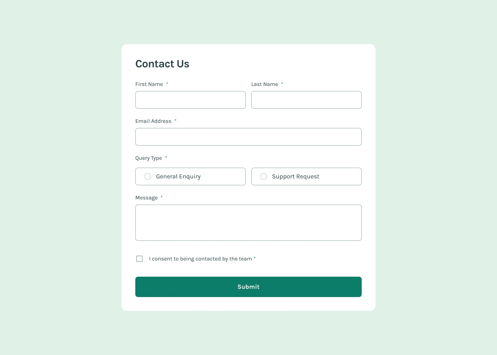

# Frontend Mentor - Contact Form Solution

This is my solution to the [Contact form challenge on Frontend Mentor](https://www.frontendmentor.io/challenges/contact-form--G-hYlqKJj).

## Overview

### The challenge

Users should be able to:

- Complete the form and see a success message on successful submission.
- See validation messages when required fields are missing or the email is invalid.
- Use the form with keyboard only.
- Have inputs, error messages, and the success message announced by screen readers.
- See hover and focus states for interactive elements.

### Screenshot



### Links

- Solution URL: [https://github.com/Muzdalifah20/frontendMentor/tree/main/contact-form-main](https://your-solution-url.com)
- Live Site URL: [https://muzdalifah20.github.io/frontendMentor/contact-form-main/](https://your-live-site-url.com)

## My process

### Built with

- Semantic HTML5
- CSS custom properties
- Flexbox
- CSS Grid
- Mobile-first workflow
- JavaScript

### What I learned

I learned how to build a form with accessible labels, validation messages, and keyboard-friendly interactions.

```js
const isValid = input.validity.valid;
```

### Continued development

I want to keep improving my form validation skills and learn more about accessible UI patterns.
I want to use this code in future:

```js
document.addEventListener(
  "blur",
  function (event) {
    // Validate the field
    const isValid = event.target.validity.valid;
    const message = event.target.validationMessage;
    const connectedValidationId = event.target.getAttribute("aria-describedby");
    const connectedValidation = connectedValidationId
      ? document.getElementById(connectedValidationId)
      : false;

    if (connectedValidation && message && !isValid) {
      connectedValidation.innerText = message;
    } else {
      connectedValidation.innerText = "";
    }
  },
  true,
);
```

### Useful resources

- [MDN Form validation](https://developer.mozilla.org/en-US/docs/Learn_web_development/Extensions/Forms/Form_validation) - helped me understand built-in validation.
- [aria-invalid](https://developer.mozilla.org/en-US/docs/Web/Accessibility/ARIA/Reference/Attributes/aria-invalid) - helped me handle validation for screen readers.
- [Form](https://web.dev/learn/forms) - helped me learn about form.

## Author

- Frontend Mentor - [https://www.frontendmentor.io/profile/Muzdalifah20](https://www.frontendmentor.io/profile/yourusername)
- GitHub - [https://github.com/Muzdalifah20](https://github.com/your-github)

## Acknowledgments

Thanks to Frontend Mentor for the challenge and to the accessibility resources that helped me build a better form.
